# Static Hand Gestures : 

## Contexte : Mise en œuvre d’un projet Machine Learning: 
 * chargement 
 * exploration
 * prétraitements
 * formalisation de la tâche,
 * choix des modèles et des méthodes
 * définition d’un protocole de test et d’évaluation de performances.

Etude de **classification** de geste à travers la lecture, la compréhension, et la proposition de modèles et de protocole d’évaluation.

## Datasets :

* [UC2017 Static and Dynamic Hand Gestures](https://zenodo.org/record/1319659#.YJrKRllfgVv)

Il s’agit d’un jeu de données de reconnaissances de gestes à partir de mesures prises par un gant de réalité virtuelle.

Il est constitué de deux sous-datasets :
*  SG - Static Gesture : la position de la main à un instant donné
*  DG - Dynamic Gesture : la série temporelle des positions

Une description plus complète des données, de la procédure d’acquisitions ainsi que des baselines sont disponibles dans l’article [ici](https://www.researchgate.net/publication/330429917_Online_Recognition_o
f_Incomplete_Gesture_Data_to_Interface_Collaborative_Robots)

Pour des raisons de simplicité, on se limitera dans un premier temps au sous-dataset Static Gesture. 

## Analyses des données :

Voici les classes des gestes disponibles dans le dataset :

  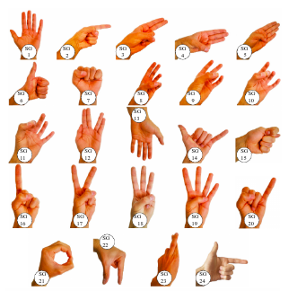

Il y a plusieurs utilisateurs, avec plusieurs mesures par exemple, ce qui pose des problèmes dont il faudra tenir compte. Il n’y a pas de découpage train/test fourni dans le dataset

Nous pouvons classifier les données en 8 classes pour l’utilisateur et en 24 classes pour le type de mouvement. 

Nous allons commencer par analyser les données et notamment leur répartition par rapport à ces class.

  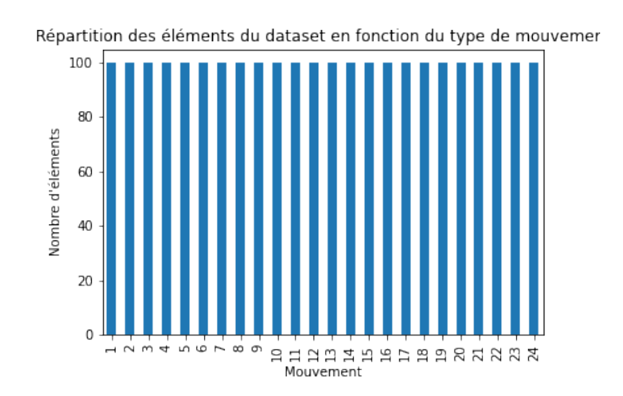

Et la répartition des gestes par utilisateur.

  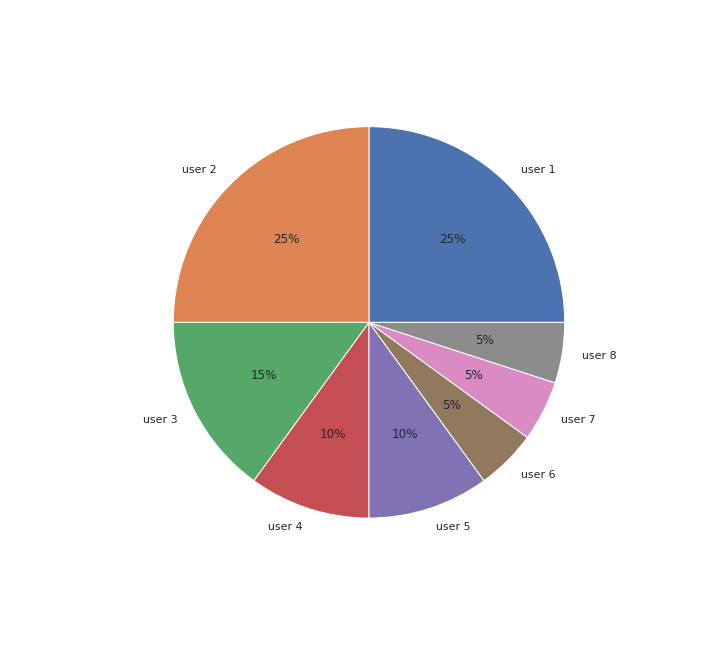

### Réduction de dimensions :

Il peut être intéressant de voir s’il y a des dépendances entre capteurs et classes. En effet, les informations apportées par certains capteurs peuvent être très discriminantes et permettre de bien classifier certains mouvements. 
À l’inverse, certains capteurs peuvent s’avérer être inutiles: Il peut être intéressant de supprimer les capteurs qui apportent trop peu d’information et de garder uniquement les capteurs les plus discriminants afin d’avoir un modèle le plus simple possible. 

Le but serait de "rassembler" les variables corrélées entre elles parmi les 29 capteurs.
Un tel procédé est possible avec une Analyse en Composantes Principales (ACP) par exemple.

  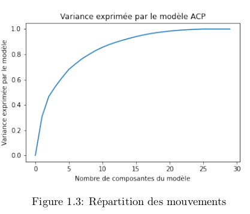

**La figure 1.3** montre la variance exprimée par un modèle ACP en fonction du nombre de composantes utilisées. 

* Naturellement, pour 29 variables, le modèle ACP exprime 100% de la
variance des données brutes. 

* Cependant, on voit que pour 7 variables, le modèle ACP exprime 75% de la variance des données brutes (fournies par les 29 capteurs).

* Une réduction de dimensions permettrait d’avoir un modèle simplifié beaucoup moins complexe que le modèle initial.

On pourra ensuite évaluer les performances de nos algorithmes de classification sur les composantes obtenues et comparer les résultats obtenus avec les données brutes.

De plus, dans le but d’une exploration plus poussée des données, il est intéressant d’extraire les caractéristiques communes aux différents gestes. Ceci peut se faire par une réduction des dimensions de l’espace des données de 9 à 2 dimensions pour une représentation graphique lisible.

  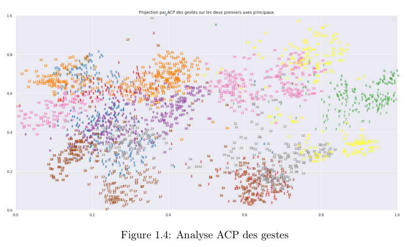

* **La figure 1.4** montre la répartition des observations en 2D après extraction de caractéristiques à l’aide de l’ACP.

* On remarque que les observations des gestes faits avec
la main ouverte se trouvent proches.
De même, il est possible que certains capteurs aient une valeur souvent (voire très souvent) nulle. Pour ce type de capteurs, on pourra cacher les zéros et chercher à prédire leur valeur en appliquant un algorithme de type **Espérance-Maximisation (E.M.)**. En effet, il est possible que
les données soient bruitées et que certains capteurs soient dysfonctionnels.

## Classification des gestes : 

* Il faut faire attention à prendre en compte le **biais** induit par l’utilisateur:

* On cherche à classifier les mouvements, indépendamment des utilisateurs.
En effet, on peut penser qu’un utilisateur aura des "patterns" ou "habitudes" dans ses mouements. Ces habitudes peuvent induire un biais. Si nous ne prenons pas en compte ce biais,nous risquons de nous retrouver avec un algorithme de classification d’utilisateurs alors que ce
n’était pas notre but.

#### Protocole expérimental:

* Séparation des éléments selon leur feature Uitlisateur.
* Validation croisée sur les données en utilisant les classes utilisateurs comme folds: On entraîne le classifieur sur 7 utilisateurs et on teste sur 1 utilisateur.
* Ou bien on entraine sur les données brutes sans split (utilsateur).

#### Modèles testés et Metrics d'évaluations :

**Modèles simples :**
* Decision Tree
* Logistic Regression
* SVM
* Naive Bayes
* KNN

**Méthodes d'ensemble  :**

* RandomForest (et BaggingClassifier)
* ExtraTree

**Metrics :**

* Accuracy

**Réseaux de neuronnes :**

ANN dont l'architecture est :

* Une couche linéaire dont la dimension d’entrée est de 29 et celle de sortie est de 1000
* Une couche d’activation de type Relu
* Une couche de dropout à un paramètre alpha
* Une couche linéaire dont la dimension d’entrée est de 1000 (cela correspond à la dimensionde sortie de la couche précéd

Nous avons choisi cette architecture moyennement profonde pour satisfaire ce compromis de performance en **accuracy** et en **temps de prédiction**.
En effet, des réseaux plus profonds pourraient certes fournir de meilleurs résultats mais le temps d’une passe forward risque d’être plus élevé. 

Notre modèle étant destiné à être utilisé pour une application en **temps réel**, il est souhaitable d’avoir un réseau peu profond.

Nous avons donc réalisé une campagne d’expérience pour évaluer ce modèle d’ANN et ainsi identifier l’effet de quelques paramètres influençant ses performances:

* **Regularization**  **dropout** avec différentes valeurs de alpha 
* **Régularisation** en ajoutant ou pas une couche de **bruit gaussien**

#### Expériances :

##### undersampling/oversampling :

  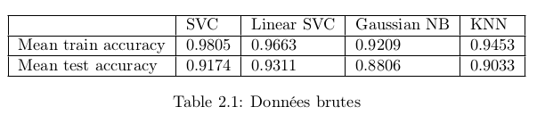

  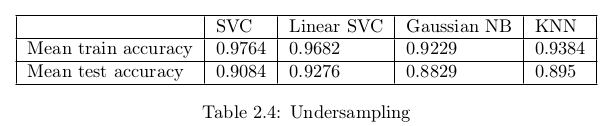

  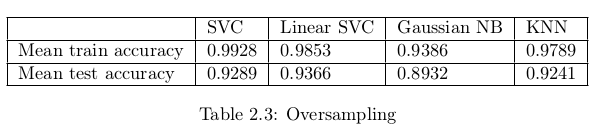

##### Comparaison des modèles simples :

On effectue une cross-validation à 5 folds sur les données
brutes normalisées et on over-sample les folds d’entraînement afin d’avoir des classes équilibrées

Le tableau 2.5 montre les résultats obtenus pour différents modèles.

  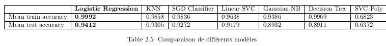

La figure 2.1 correspond à la matrice de confusion obtenue en test par notre meilleur modèle simple(régression logistique). Le taux de classification semble être très bon et le nombre de faux-positifs/faux-négatifs est minime.

  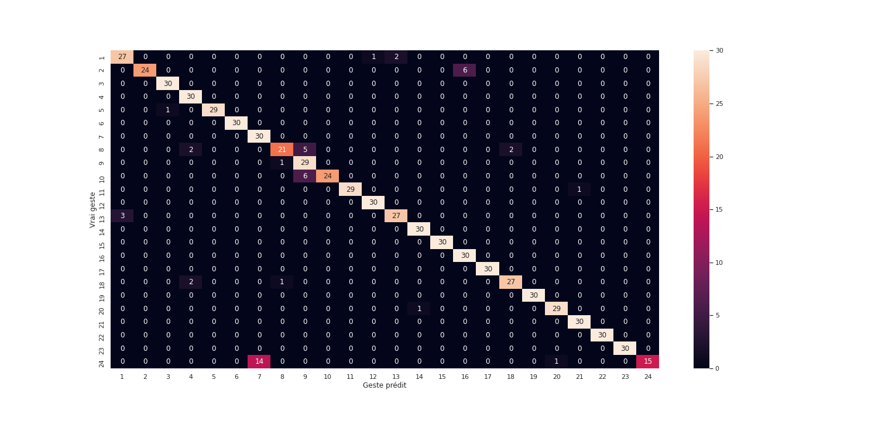

##### Comparaison des méthodes d'ensembles :
* **Note:** le nombre après le nom du modèle correspond au
nombre de composantes) Les résultats sont meilleurs que sur les modèles simples.

  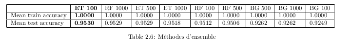

Un GridSearch sur l’ensemble des modèles ainsi que sur plusieurs paramètres nous indique qu’un modèle de type **RandomForest** renvoie les meilleurs résultats.

##### Sélection de caractéristiques  :

Nous allons maintenant tenter de réduire la dimension initiale des features (29).

Pour cela, nous allons seulement garder les features les plus discriminantes. Le nombre de features à garder est un **hyperparamètre** que nous déterminerons.

* La figure 2.2 montre la part d’**importance** de chaque feature dans l’algorithme **RandomForest**.

* Nous pouvons éliminer les premières features qui semblent apporter trop peu d’information et privilégier les dernières.

  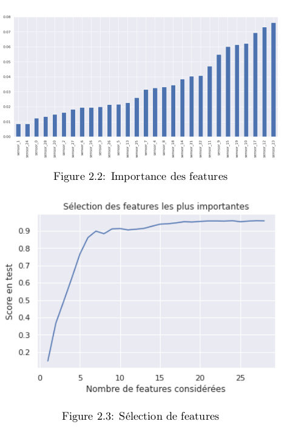

* La figure 2.3 montre le score obtenu en fonction du nombre de features sélectionnées. Les features ont été sélectionnées par ordre d’importance dans la figure 2.2. 

* Nous pouvons voir qu’en sélectionnant les 7 features les plus importantes, nous obtenons déjà 90% d’accuracy en test.

* Augmenter le nombre de features au-delà de 7 n’augmente pas le score de façon significative.

#### Compagne d'expériance ANN :

...

